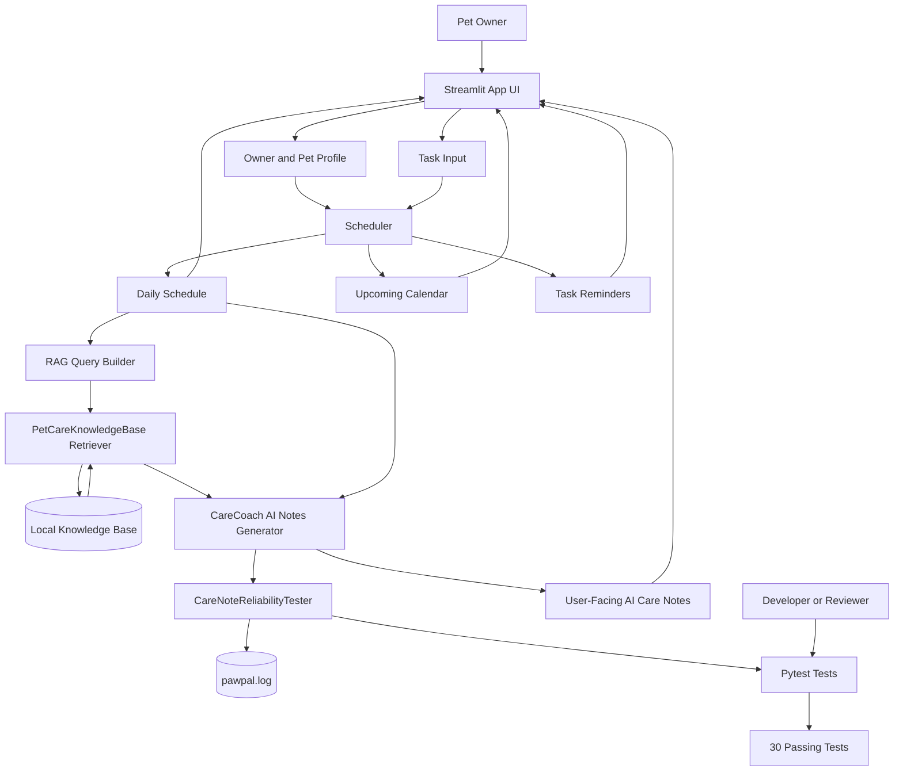
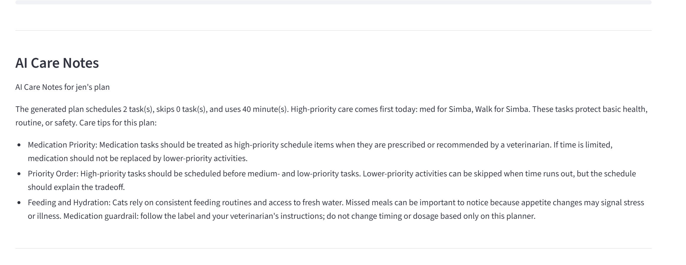
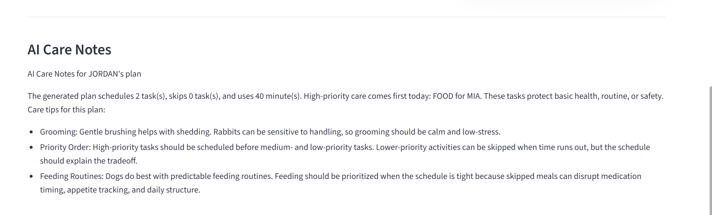
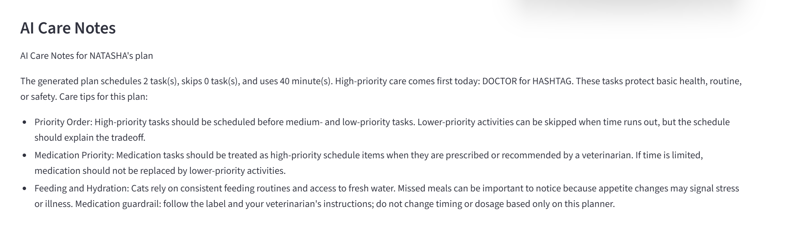

# PawPal+

PawPal+ is an AI-assisted pet care planning app built with Python and Streamlit. It helps busy pet owners manage recurring care tasks, generate a realistic daily schedule, view upcoming tasks on a calendar, receive reminders, and get AI care notes grounded in a local pet-care knowledge base.

The project matters because pet care is often a coordination problem: owners need to balance time, urgency, medication safety, exercise, enrichment, and multiple pets. PawPal+ combines deterministic scheduling with retrieval-augmented AI explanations so the app is useful, reproducible, and safer than a generic chatbot response.

## Original Project

My original Modules 1-3 project was **PawPal+**, a pet care scheduling system for owners managing daily care routines. The original goal was to let a user create an owner profile, add pets, enter care tasks, and generate a daily plan based on time available, priority, recurring frequency, and task conflicts. It already supported multi-pet task management, checklists, filtering, recurring tasks, conflict detection, urgent reminders, and unit tests for the scheduling logic.

This version extends the original scheduler with an integrated AI layer: local Retrieval-Augmented Generation (RAG), reliability checks, logging, and an upcoming calendar view for recurring tasks.

## Features

- Owner and multi-pet setup
- Task creation with category, duration, priority, frequency, first due date, notes, and optional start time
- Daily schedule generation based on time budget and priority
- Weekly and biweekly recurring tasks based on the user's selected first due date
- Upcoming calendar view for the next 7, 14, 21, or 28 days
- In-app task reminders for tasks starting soon, due now, or overdue
- Checklist support so users can mark scheduled, skipped, or general tasks as done
- Conflict detection for overlapping timed tasks for the same pet
- RAG-powered AI Care Notes based on retrieved pet-care guidance
- Reliability checks and medication guardrails behind the scenes
- Logging to `pawpal.log`
- Automated tests with `pytest`

## Architecture Overview

PawPal+ separates the deterministic planning logic from the AI support layer. The scheduler decides what should happen today; the RAG system explains the schedule using retrieved pet-care knowledge; the reliability tester checks the generated note for basic safety and consistency.



### Main Components

| Component | File | Purpose |
|---|---|---|
| Streamlit UI | `app.py` | Collects user input and displays pets, tasks, schedule, reminders, calendar, and AI notes. |
| Core data model | `pawpal_system.py` | Defines `Task`, `Pet`, `Owner`, `Schedule`, and `Scheduler`. |
| Scheduler | `pawpal_system.py` | Sorts, filters, detects conflicts, handles recurring tasks, and generates daily plans. |
| Knowledge base | `knowledge_base/*.md` | Local care guidance for dogs, cats, rabbits, medication safety, enrichment, and scheduling. |
| Retriever | `care_ai.py` | Retrieves relevant markdown sections based on the generated schedule. |
| Care coach | `care_ai.py` | Generates user-facing AI Care Notes from schedule data plus retrieved guidance. |
| Reliability tester | `care_ai.py` | Checks AI notes for retrieved context, skipped/urgent task coverage, medication guardrails, and unsafe advice patterns. |
| Tests | `tests/` | Verifies scheduling, recurrence, conflicts, RAG retrieval, care-note generation, and reliability checks. |

## How RAG Is Used

PawPal+ does not ask AI for generic pet advice. After the user generates a schedule, the app builds a query from the actual plan: pet species, task names, priorities, skipped tasks, urgent tasks, conflicts, notes, and categories.

That query is sent to `PetCareKnowledgeBase`, which retrieves relevant guidance from local markdown files. `CareCoach` then uses the retrieved context and the schedule to create AI Care Notes. The user sees the final care advice, while source filenames and reliability check details stay internal for logging and testing.

## Setup Instructions

### 1. Clone the repository

```bash
git clone https://github.com/afnawar910/applied-ai-system-project.git
cd applied-ai-system-project
```

If you are already inside the downloaded project folder, just open the project directory:

```bash
cd ai110-module2show-pawpal-starter
```

### 2. Create and activate a virtual environment

Windows:

```bash
python -m venv .venv
.venv\Scripts\activate
```

macOS/Linux:

```bash
python -m venv .venv
source .venv/bin/activate
```

### 3. Install dependencies

```bash
pip install -r requirements.txt
```

### 4. Run the app

```bash
streamlit run app.py
```

Then open the local Streamlit URL shown in your terminal, usually:

```text
http://localhost:8501
```

### 5. Run tests

```bash
python -m pytest
```

No external API key is required. The RAG system uses local files in `knowledge_base/`, which makes the project reproducible.

## Sample Interactions

### Example 1: Daily dog schedule with AI notes

Input:

```text
Owner: Annie
Available time: 45 minutes
Pet: Leo, dog
Tasks:
- Morning walk, walk, 30 min, high, daily, 09:00
- Breakfast, feeding, 10 min, high, daily, 08:00
- Fetch, enrichment, 20 min, low, daily, 17:00
```

Result:

```text
Scheduled:
- Breakfast for Leo at 08:00
- Morning walk for Leo at 09:00

Skipped:
- Fetch for Leo: not enough time today

AI Care Notes:
The plan prioritizes Leo's feeding and walk because they support routine, health, and daily exercise. Fetch was skipped because the time budget was limited, but a short enrichment session could be added later if Annie has extra time.
```

### Example 2: Medication task with guardrail

Input:

```text
Owner: Jordan
Available time: 10 minutes
Pet: Mochi, dog
Tasks:
- Flea medication, meds, 15 min, high, biweekly, first due today, 08:30
- Brush coat, grooming, 15 min, medium, weekly, first due tomorrow
```

Result:

```text
Scheduled:
- Flea medication for Mochi at 08:30

Urgent reminder:
- Flea medication exceeds the time budget but was kept because it is high priority.

AI Care Notes:
Mochi's medication was kept even though the plan is over budget because medication tasks should not be replaced by lower-priority grooming. Follow the medication label and veterinarian instructions; do not change timing or dosage based only on this planner.
```

### Example 3: Upcoming calendar

Input:

```text
Pet: Luna, cat
Tasks:
- Breakfast, feeding, 5 min, high, daily
- Brush coat, grooming, 15 min, medium, weekly, first due Apr 27
- Nail check, grooming, 10 min, low, biweekly, first due Apr 27
Calendar range: 14 days
```

Result:

```text
Upcoming calendar:
- Every day: Breakfast
- Apr 27: Brush coat, Nail check
- May 4: Brush coat
- May 11: Brush coat, Nail check
```

## Design Decisions

### Deterministic scheduler first

I kept scheduling deterministic instead of letting the AI decide the plan. The scheduler uses explicit rules for time budget, priority, recurrence, conflict detection, and skipped tasks. This makes the app easier to test and safer for care-related workflows.

Trade-off: deterministic rules are less flexible than a fully agentic planner, but they are much more predictable and easier to debug.

### RAG instead of a generic chatbot

The AI feature uses local retrieval from `knowledge_base/` before generating care notes. This keeps responses grounded in project-owned content and avoids depending on a live external API.

Trade-off: the local knowledge base is smaller than the open internet, but it is reproducible, inspectable, and safer for a class project or portfolio demo.

### Reliability checks are internal

The app runs reliability checks on the AI notes, but it does not show raw PASS/FAIL checks to the user. Those details are useful for developers and tests, but they made the UI feel technical and cluttered.

Trade-off: users see a cleaner experience, while developers can still inspect logs and tests to verify the AI behavior.

### Calendar view for recurring tasks

The original app only generated today's schedule. I added an upcoming calendar because weekly and biweekly care tasks are easier to understand visually across multiple days.

Trade-off: the calendar is currently a simple Streamlit grid, not a full drag-and-drop calendar. This keeps the implementation lightweight and testable.

## Testing Summary

The project currently has **30 passing tests**.

Tested areas include:

- Task completion and checklist state
- Daily, weekly, biweekly, and as-needed recurrence behavior
- End-time calculation from start time and duration
- Adding/removing tasks and duplicate detection
- Sorting by start time
- Filtering by pet, status, and category
- Conflict detection for overlapping tasks
- Empty states and zero-time-budget edge cases
- High-priority urgent scheduling
- Upcoming calendar occurrence generation
- RAG retrieval from the local knowledge base
- AI Care Notes generation using schedule context
- Reliability checks for unsafe medication advice and missing retrieved context

What worked well:

- Keeping the scheduler separate from Streamlit made the core logic easy to test.
- Local RAG made the AI feature reproducible without API keys.
- Reliability checks helped turn the AI feature into an engineered system instead of a decorative add-on.

What did not work perfectly:

- Streamlit session state is not covered by automated tests.
- The AI notes are template-based and retrieval-grounded rather than powered by a hosted LLM.
- The calendar is functional but intentionally simple.

What I learned:

- AI features are stronger when paired with deterministic logic, tests, and guardrails.
- RAG is most useful when retrieval meaningfully changes the final output.
- User-facing AI should hide internal evaluation details unless the user specifically needs them.

## Reflection

This project taught me that building with AI is not just about generating text. The harder and more valuable work is designing the system around the AI: deciding what data it should see, what it should not decide, how to test it, and how to make failures safe.

I also learned the importance of separating user experience from developer evidence. The app needs logs, tests, and reliability checks to be trustworthy, but the user should see a clean care plan, reminders, and helpful guidance rather than raw implementation details.

Overall, PawPal+ became a practical example of human-centered AI: deterministic scheduling handles the high-stakes structure, RAG adds contextual explanation, and testing gives confidence that the system behaves consistently.


